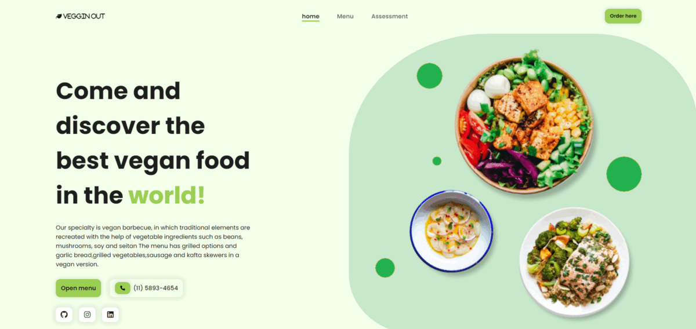

<h1 id="title">Veggin out</h1>

It is a responsive and creative page for study purposes, thinking about bringing more visibility to a healthy life and with a higher quality, HTML, CSS, JavaScript, Jquery were used

<h2>⚙️Features</h2>

Here're some of the project's best features:

*   HTML
*   CSS
*   JavaScript
*   Jquery

<h2>🛠️Clone</h2>

To clone your repository using the command line via HTTPS, go to "Quick Setup". 

Clone the repository using an SSH key, including a certificate issued by your organization's SSH certificate authority.

Open Git Bash.

Change the current working directory to the location where you want to have the directory cloned.

Type git clone and paste the already copied URL.

git clone https://github.com/YOUR-USERNAME/YOUR-REPOSITORY
Press ENTER to create your local clone.